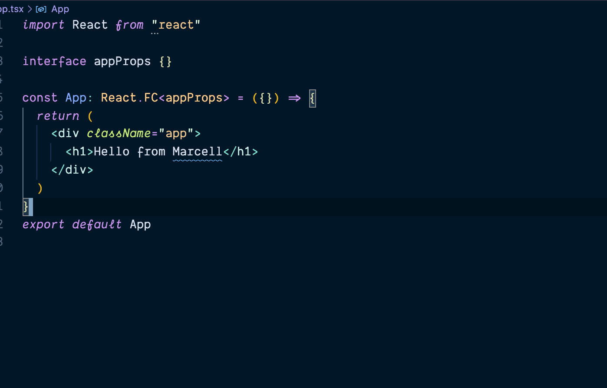
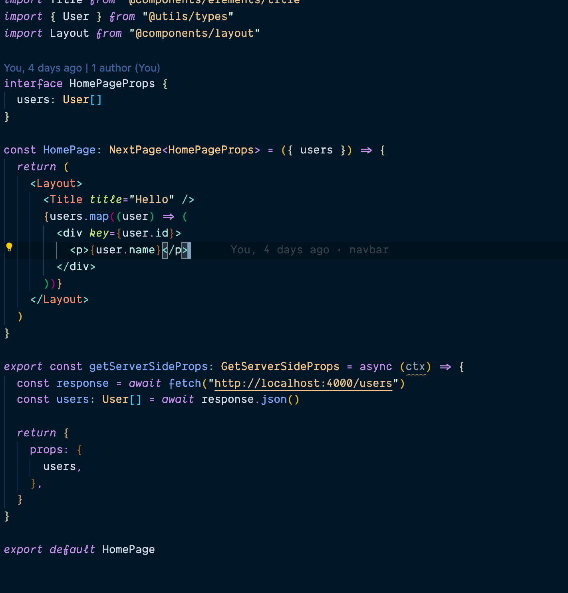

# Masiu theme 🎨👩🏻‍🎨

This is my VS code theme. It is a clone of the very popular _Night owl theme_ by [Sarah Drasner](https://github.com/sdras)

I love the theme and the Italic style, specially if you using a font like _Operator mono_ or _Dank mono_.
I just wanted less italic so I forked the theme and just changed the configuration when it should be italic ore not, just how I liked it.

### Example 1

### Example 2

